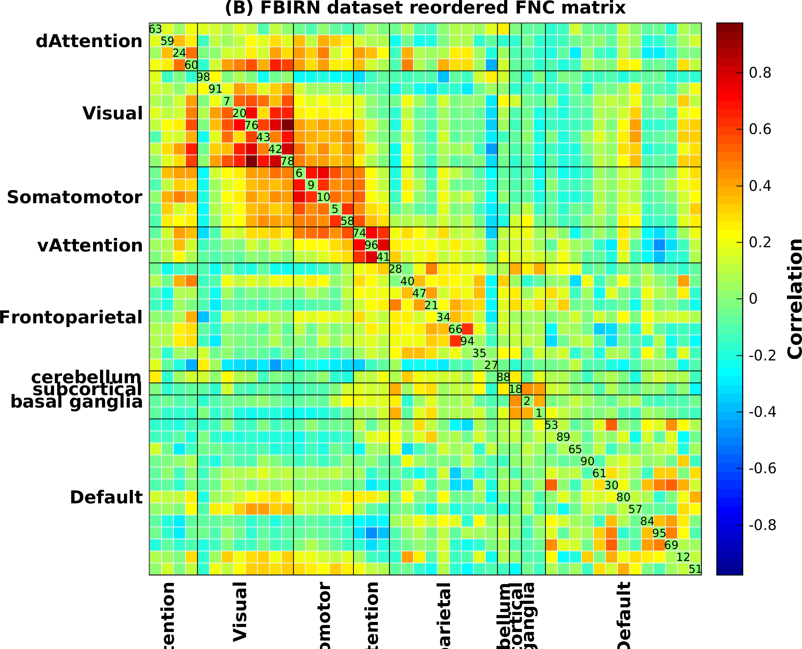

# Autolabeller

This tool can automatically generate anatomical and functional labels of spatial maps of brain activity.

## Prerequisites

Autolabeller is written in Matlab™ and requires several Matlab toolboxes to run. Please download the following toolboxes, put them in the `/bin` directory and add to your Matlab path.

- [GIFT](https://github.com/trendscenter/gift)
- [SPM12](https://www.fil.ion.ucl.ac.uk/spm/software/spm12/)
- [CanlabCore](https://github.com/canlab/CanlabCore)
- [BCT Toolbox](https://sites.google.com/site/bctnet/) (March 2019 release)

To use the optional visualization scripts (`src/example_plot_results_*.m`), some additional toolboxes are needed:

- MCIv4 (included in `bin` directory)
- [export_fig](https://github.com/altmany/export_fig)
- [funfc](https://github.com/esalman/funfc)

## Using the autolabeller

Example code can be found in `src/example_label_ic.m`. Note that it requires around 4GB of RAM to run. For visualization, `src/example_plot_results_fbirn.m` can be used as a starting point.

    % add paths
    % GIFT toolbox
    addpath( genpath( '/trdapps/linux-x86_64/matlab/toolboxes/GroupICATv4.0b/' ) )
    % SPM12 toolbox
    addpath( genpath( '/trdapps/linux-x86_64/matlab/toolboxes/spm12/' ) )
    % CANlabCore toolbox
    addpath( genpath( '../bin/CanlabCore/' ) )
    % brain connectivity toolbox
    addpath('../bin/2019_03_03_BCT')

    % fbirn GICA example
    clear params;
    params.param_file = 'ICAresults_C100_fbirn/fbirnp3_rest_ica_parameter_info.mat';
    params.outpath = '../results/fbirn/';
    params.n_corr = 3;
    params.fit_method = 'mnr';
    disp( 'FBIRN run the autolabeller' )
    label_auto_main( params );

    % neuromark spatial map example
    clear params;
    params.sm_path = 'NetworkTemplate/NetworkTemplate_High_VarNor.nii';
    params.outpath = '../results/neuromark/';
    params.n_corr = 3;
    params.fit_method = 'mnr';
    disp( 'NeuroMark run the autolabeller' )
    label_auto_main( params );

## Result

