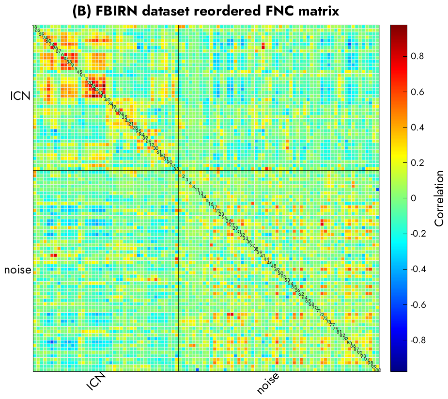
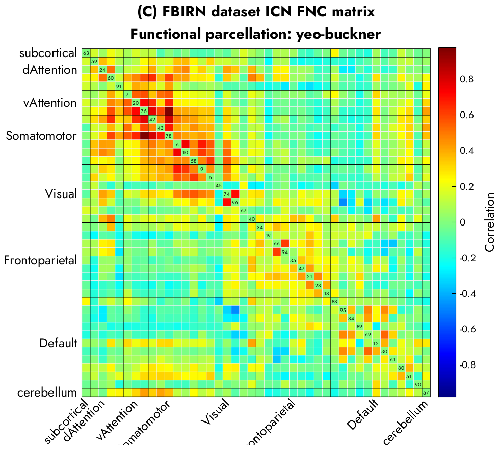

# Autolabeller

This tool can automatically classify noisy spatial maps of brain activity, and generate anatomical and functional labels of the spatial maps and a reordered functional network connectivity matrix.

## Prerequisites

Autolabeller is written in Matlab™ and requires several Matlab toolboxes to run. Please download the following toolboxes and add to your Matlab path.

- [GIFT](https://github.com/trendscenter/gift)
- [SPM12](https://www.fil.ion.ucl.ac.uk/spm/software/spm12/)
- [CanlabCore](https://github.com/canlab/CanlabCore)
- [BCT Toolbox](https://sites.google.com/site/bctnet/) (March 2019 release)

## Using the autolabeller

Example code can be found in `src/example_label_ic.m`.

    % add requirements to path
    addpath( genpath( '../bin/GroupICATv4.0b/' ) )      % GIFT toolbox
    addpath( genpath( '../bin/CanlabCore' ) )       % Canlab toolbox
    addpath( '../bin/spm12/' )      % SPM12 toolbox
    addpath( '../bin/2019_03_03_BCT' )       % Brain connectivity toolbox
    addpath( '../bin/autolabeller/' )       % add the autolabeller src folder only

    % GICA example with fbirn dataset
    clear params;
    params.param_file = './fbirnp3_rest_ica_parameter_info.mat';
    params.outpath = './results/fbirn/';
    params.fit_method = 'mnr';
    params.n_corr = 3;
    params.skip_noise = 0;
    params.skip_anatomical = 0;
    params.skip_functional = 0;
    params.noise_training_set = 'pre_fbirn_sub';
    params.anatomical_atlas = 'aal';
    params.threshold = 3;
    params.functional_atlas = 'yeo_buckner';
    disp( 'Running the autolabeller on FBIRN dataset' )
    label_auto_main( params );

    % Spatial map example with the Neuromark template
    clear params;
    params.sm_path = './NetworkTemplate_High_VarNor.nii';
    params.mask_path = './Mask.img';
    params.outpath = './results/neuromark/';
    params.fit_method = 'mnr';
    params.n_corr = 3;
    params.skip_noise = 0;
    params.skip_anatomical = 0;
    params.skip_functional = 0;
    params.noise_training_set = 'pre_aggregate';
    params.anatomical_atlas = 'aal';
    params.threshold = 3;
    params.functional_atlas = 'yeo_buckner';
    disp( 'Running the autolabeller on NeuroMark dataset' )
    label_auto_main( params );

## Parameters & outputs

### Inputs
* `params.param_file` Location of GICA parameter file
* `params.sm_path` Location of NIFTI data containing spatial maps. Use this if you are not running GICA.
* `params.outpath` Output directory
* `params.n_corr` How many ROI top correlations to calculate for anatomical/functional labeling. Default = 3
* `params.threshold` Threshold value for the spatial maps. Default = 3
* `params.skip_noise` If you do not want to run or already ran artifact detection step, set to 1. Otherwise set to 0 by default.
* `params.skip_anatomical` If you do not want to run or already ran anatomical labeling step, set to 1. Otherwise set to 0 by default.
* `params.skip_functional` If you do not want to run or already ran functional labeling step, set to 1. Otherwise set to 0 by default.
* `params.noise_training_set` Which dataset to use to train the noisecloud model. Options: `pre_fbirn_sub`, `pre_aggregate`
    - `pre_fbirn_sub`: when both spatial maps and timecourses are available, as in a GIFT output
    - `pre_aggregate`: when only spatial maps are available
* `params.anatomical_atlas` Which atlas to use for anatomical labeling. Options: `aal`
* `params.functional_atlas` Which atlas to use for functional labeling. Options: `yeo_buckner`, `gordon2016`, `caren`. Default = `yeo_buckner`.

### Outputs
The following files are written into params.outpath folder:
* `network_labels.csv` Network labels vector (0=artifact, 1=network) and probability that the component/spatial map is a network
* `anatomical_labels.csv` AAL anatomical region with highest correlations to the spatial maps
* `functional_labels.csv` Functional parcellations with highest correlations to the spatial maps
* `sorted_IC_idx.csv` sorted IC index
* `sorted_fnc.csv` sorted FNC matrix

## Result

## Customizing the output

The autolabeler outputs can be easily updated based on visual observation as follows:
- Change the network(1)/noise(0) labels corresponding to the IC you want to update in `network_labels.csv`.
- Set `params.skip_noise = 1`
- Run the autolabeller with the original parameters again.

This will generate the updated anatomical/functional label files and IC order for the FNC matrix.

## Citation

Salman, M.S., Wager, T.D., Damaraju, E.C., Abrol, A., Calhoun, V.D., 2020. An Approach to Automatically Label & Order Brain Activity/Component Maps. bioRxiv 2020.08.31.275578. https://doi.org/10.1101/2020.08.31.275578

